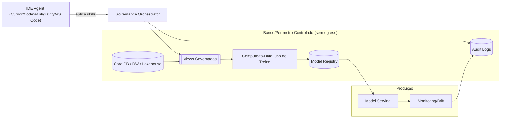

# Architecture Overview

## Key Principles
- **Compute-to-Data**: dados não saem do perímetro; saem apenas modelos e métricas agregadas.
- **Deny-by-default**: RBAC/ABAC e acesso mínimo.
- **Evidence-first**: toda ação gera `report.md` + `evidence.json`.
