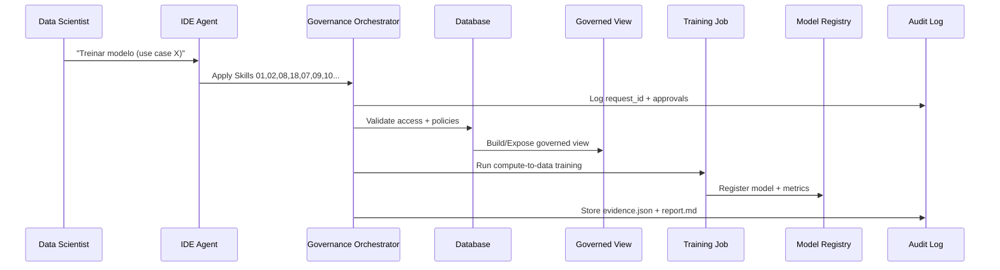

# Data Flow (Governed)

```mermaid
sequenceDiagram
  participant DS as Data Scientist
  participant IDE as IDE Agent
  participant GOV as Governance Orchestrator
  participant DB as Database
  participant V as Governed View
  participant T as Training Job
  participant M as Model Registry
  participant A as Audit Log

  DS->>IDE: "Treinar modelo (use case X)"
  IDE->>GOV: Apply Skills 01,02,08,18,07,09,10...
  GOV->>A: Log request_id + approvals
  GOV->>DB: Validate access + policies
  DB->>V: Build/Expose governed view
  GOV->>T: Run compute-to-data training
  T->>M: Register model + metrics
  GOV->>A: Store evidence.json + report.md
```

## Leakage controls
- Time-based split for financial data
- Feature cutoff date (no future features)
- Only aggregate metrics exported
