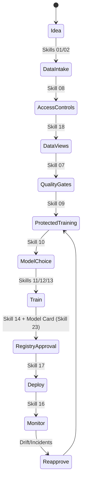

# ML Governance Lifecycle

```mermaid
stateDiagram-v2
  [*] --> Idea
  Idea --> DataIntake: Skills 01/02
  DataIntake --> AccessControls: Skill 08
  AccessControls --> DataViews: Skill 18
  DataViews --> QualityGates: Skill 07
  QualityGates --> ProtectedTraining: Skill 09
  ProtectedTraining --> ModelChoice: Skill 10
  ModelChoice --> Train: Skills 11/12/13
  Train --> RegistryApproval: Skill 14 + Model Card (Skill 23)
  RegistryApproval --> Deploy: Skill 17
  Deploy --> Monitor: Skill 16
  Monitor --> Reapprove: Drift/Incidents
  Reapprove --> ProtectedTraining
```

## Outputs per stage
- Evidence pack (Skill 22) always generated
- Model card required before production
